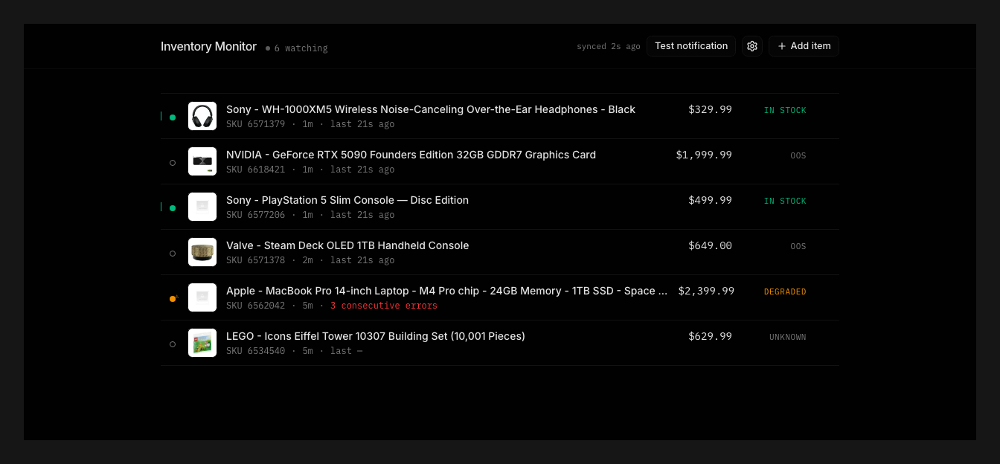
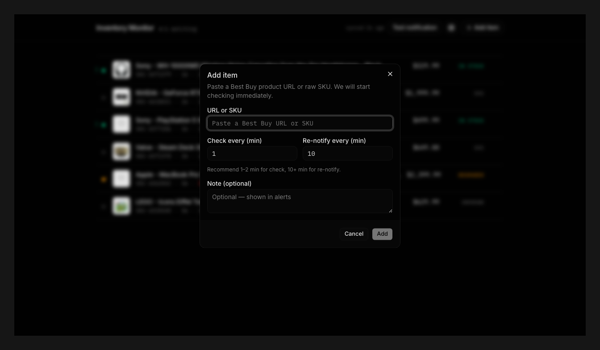
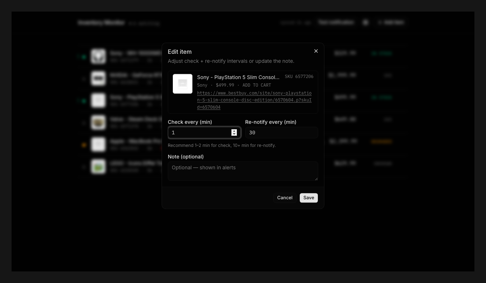
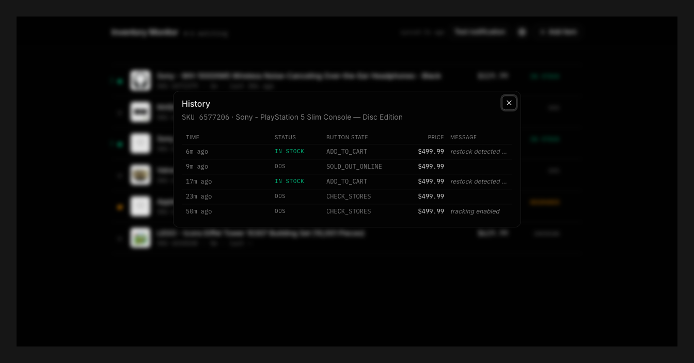
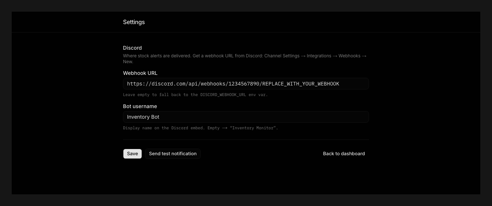

# inventory-checker

A self-hosted Best Buy stock monitor. Polls the `priceBlocks` JSON endpoint per-SKU, sends a rich Discord webhook the instant items go from out-of-stock to in-stock, with a one-click cart link. Designed for personal use on a small VPS, gated by Cloudflare Access.

> See [SPEC.md](./SPEC.md) for the full design — architecture, state machine, retention semantics, risks, and tests.

---

## Dashboard

A single-page dashboard. Add items by pasting a URL or SKU, configure check + re-notify intervals, watch transitions roll in.



Each row shows the live stock state (`IN STOCK` / `OOS` / `DEGRADED` / `UNKNOWN`), the SKU, configured check interval, and how recently the worker last polled. The dot on the left tracks the same status colour-coded.

### Add an item

Paste any of these:

- New-format URL: `https://www.bestbuy.com/product/.../sku/6587182`
- Old-format URL: `https://www.bestbuy.com/site/.../6587182.p?skuId=6587182`
- A bare SKU: `6587182`

The dialog auto-fetches the product image, name, and price from Best Buy as you paste.



### Edit an item

Adjust the per-item check interval, re-notify interval, and note. The note is shown in the Discord embed — useful for tagging an item with the bot strategy you'll fire on restock.



### History

Every transition, error, and notification attempt is logged. Useful for debugging false positives or auditing how often a SKU has been restocking.



### Settings

Discord webhook URL and bot username are stored in the DB so they can be edited without redeploying. They fall back to env vars if unset.



---

## How it works

```
Browser → Cloudflare Access (email gate) → VPS:3000 (Next.js app) ─┐
                                                                    ├→ data/data.db (SQLite, WAL)
                                            VPS (worker.ts) ────────┘    ↑
                                                  │                       │
                                                  ▼                       │
                                        Best Buy priceBlocks API ─────────┘
                                        Discord webhook
```

Two pm2 processes share one SQLite file. The worker handles polling, the Next.js app handles the dashboard UI and CRUD API.

## Quick start (local dev)

```bash
npm install
cp .env.example .env
# edit .env — at minimum, set DISCORD_WEBHOOK_URL
npm run db:migrate

# in two terminals:
npm run dev          # next dev → http://localhost:3000
npm run dev:worker   # polling loop with hot reload
```

Open `http://localhost:3000`, paste a Best Buy URL or SKU, click Add.

## Deploy on a VPS

Prereqs: a VPS with Node 22+, your domain on Cloudflare, and a Cloudflare Access policy that allow-lists your email for `inventory.{your-domain}`.

```bash
# on the VPS
git clone <your-repo>
cd inventory-checker
npm install
cp .env.example .env
nano .env                        # set DISCORD_WEBHOOK_URL
npm run db:migrate
npm run build
npm install -g pm2
pm2 start ecosystem.config.cjs
pm2 save
pm2 startup                       # follow the printed sudo command for boot persistence
```

Reverse-proxy / origin setup:
- Point `inventory.{your-domain}` at the VPS via Cloudflare DNS (proxied / orange cloud).
- Origin firewall: only accept inbound traffic on the app port from Cloudflare IPs.
- Add a Cloudflare Access application that requires email auth (allowlist your address).

Update flow:
```bash
git pull && npm install && npm run build && pm2 reload all
```

Logs:
```bash
pm2 logs inventory-worker --lines 200
pm2 logs inventory-app --lines 200
```

## Environment variables

| Var | Required | Default | Notes |
|---|---|---|---|
| `DISCORD_WEBHOOK_URL` | yes | — | Where alerts go. Without it, the worker still polls but logs a warning and `/api/test-notification` returns 400. |
| `DATABASE_PATH` | no | `data/data.db` | Path to the SQLite file (relative to cwd). |
| `WORKER_VERSION` | no | `dev` | Surfaced in `/api/health`. Helpful when you have multiple deployments. |
| `PORT` | no | `3000` | Next.js server port. |
| `BESTBUY_PROXIES` | no | — | Reserved for proxy rotation. Not yet wired (see SPEC §14). |

## Project layout

```
src/
├── app/
│   ├── api/            # route handlers (Next 16 App Router)
│   │   ├── items/
│   │   ├── settings/
│   │   ├── test-notification/
│   │   └── health/
│   ├── settings/       # /settings page
│   ├── layout.tsx
│   ├── page.tsx
│   └── globals.css     # SPEC §11 dark theme
├── components/         # dashboard UI (dialogs, rows, header)
│   └── ui/             # shadcn primitives
├── lib/
│   ├── db/             # drizzle schema + better-sqlite3 client
│   ├── parse-input.ts  # smart URL/SKU parser
│   ├── bestbuy.ts      # priceBlocks fetch + interpretStock
│   ├── discord.ts      # rich-embed webhook sender
│   ├── checker.ts      # applyCheckResult — the transactional pipeline
│   └── api.ts          # client-side fetch helpers
├── worker/index.ts     # polling loop
test/                   # vitest — covers libs + checker
drizzle/                # generated migrations
data/                   # SQLite file (gitignored)
ecosystem.config.cjs    # pm2 manifest
```

## Tests

```bash
npm test
```

Covers the parser, stock interpretation, Discord payloads, and the full checker state machine (transitions, dedupe, errors, restart-no-dupes, concurrency).

## Stock signal

`buttonState === 'ADD_TO_CART'` (or `LOW_STOCK` / `IN_CART`) → IN_STOCK. Anything else (CHECK_STORES, SOLD_OUT_*, COMING_SOON, PRE_ORDER, missing) → OUT_OF_STOCK. We deliberately ignore the API's `purchasable: true` field on its own because Best Buy returns it for in-store-only items.

## Notification semantics

- First-ever check resolves to IN_STOCK → fire alert.
- Out-of-stock → in-stock transition → fire alert.
- Still in stock past the re-notify interval → fire reminder.
- Goes back out of stock → reset the reminder clock; no notification on the way out.
- HTTP errors → never change stock state; bump `consecutive_errors`; mark health DEGRADED at 3, ERROR at 5.

Webhook delivery is best-effort with reminder-based recovery. If the worker crashes between DB commit and the actual webhook fire, the next reminder window picks up the slack. See SPEC §7.4 for the full delivery contract.

## License

[MIT](./LICENSE). Not affiliated with Best Buy.
